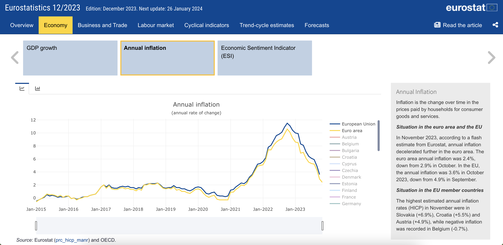

# eurostatRTool

The eurostatRTool is an R package developed by Eurostat, offering a robust and flexible environment 
for the visualisation and analysis of economic indicators. With eurostatRTool, 
users can create customisable HTML dashboards that display a wide range of indicators 
through various visualisation types, including time series plots, bar charts, and maps. 
The package enables users to customise the overall layout, update underlying data, 
and select specific visualisation modes and interpretative texts to feature in the dashboard. 
This flexibility makes it easy to tailor the tool to specific needs, ensuring that the visualised data is both meaningful and accessible for viewers.

A standout feature of eurostatRTool is the storyboard layout from `Flexdashboard` that organises information into a sequence of slides. 
This layout allows to present a step-by-step narrative, providing readers with a more comprehensive understanding of the data. 
The user-friendly navigation enables viewers to move back and forth through the data story at their own pace, fostering a more interactive and engaging data exploration.

## Installation

### For Windows users: install Rtools

For installing R packages from source on Windows, users also need to
install `Rtools`, which provides the necessary tools for building R
packages.

1.  Download: go to the [Rtools download
    page](https://cran.r-project.org/bin/windows/Rtools/) and download
    the appropriate version of `Rtools`.

2.  Install: run the downloaded installer and follow the installation
    instructions. Make sure to select the option to modify the system
    PATH during installation.

### Install devtools package in R

Open R or RStudio and install the `devtools` package from CRAN:

``` r
install.packages("devtools")
```

### Install R package from source

Now, you can use `devtools::install_github()` or `devtools::install()`
to install R packages directly from GitHub or other sources.
Specifically, the eurostatRTool package can be installed from GitHub by
running:

``` r
devtools::install_github("eurostat/eurostatRTool")
```
The following packages are required: `configr`,  `dplyr`,  `DT`, `flexdashboard`, `htmltools`, `leaflet`, `lubridate`, `magick`,
`magrittr`, `mapview`,  `metathis`, `plotly`, `rmarkdown`, `shiny`, `shinydashboard`, `sp`, `tidyr`, `utils` and `xlsx`.

Setting up an `renv` environment for this project is recommended but not
mandatory. For more information, you should consult the [Wiki pages for this project](https://github.com/eurostat/eurostatRTool/wiki). 

## Getting started

The eurostatRTool package requires some learning to be
used properly. Below we provide a basic example which shows you how to generate a
general dashboard in a given output folder:

``` r
library(eurostatRTool)
eurostatRTool::generate_dashboard("path/to/output/folder")
```



## Further help and documentation

For general help with the eurostatRTool package, you should consult the [Wiki pages for this project](https://github.com/eurostat/eurostatRTool/wiki) 
or reffer to the package’s documentation. After instalation you can access detailed information on individual functions by using `?function_name` and explore comrehensive guides through the vignettes by running `utils::browseVignettes("eurostatRTool")`.

If you have any further questions, please send them to [ESTAT-EUROINDICATORS@ec.europa.eu](mailto:ESTAT-EUROINDICATORS@ec.europa.eu).
