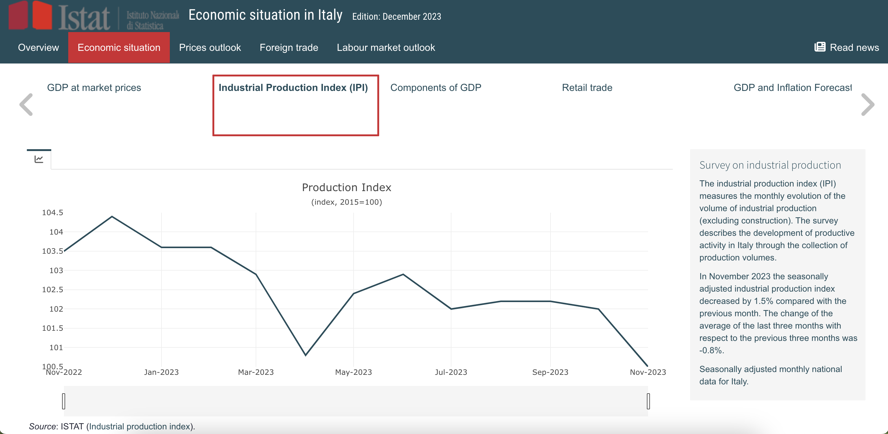

```{r, include = FALSE}
knitr::opts_chunk$set(
  collapse = TRUE,
  comment = "#>"
)

options(rmarkdown.html_vignette.check_title = FALSE)
```

```{r setup}
library(eurostatRTool)
```

Two different demonstration dashboards are available, containing different structure, indicators, visualisation elements and interpretations, but both built from public data published in December 2023. 

The demo dashboards are derived from two alternative scenarios that are proposed as use cases:

**Eurostatistics**:

This scenario was designed for the dissemination of Eurostat data on short-term economic analysis.  

**NSI**:

The general structure of this scenario was specifically designed to allow different National Statistical Institutions (NSIs) sharing short-term economic analysis of national indicators among different end users.

### Eurostatistics demonstration dashboard

A sample dashboard of the Eurostatistics scenario is available by calling the main function `generate_dashboard(output_path)`. In this function, the `output_path` parameter is the absolute path to the folder where the resulting html file will be saved. By running this function, you will save the sample dashboard as an html file into the `output_path` folder. Apart from the html file, a new folder named `visualisation_files` will be also saved in your `output_path` folder. This new folder will contain additional resources required for the dashboard that ensure the resulting html file has a moderate size even if many visualisation elements are included in the final dashboard. Below you can find a screenshot took from the resulting html:

```{r echo=FALSE, fig.align='center', fig.cap='', out.width='100%'}
knitr::include_graphics('img/eurostatistics-dashboard-example.png')
```

### NSI demonstration dashboard

The sample version of the NSI scenario is built on public national data from Italy collected from [ISTAT website](https://www.istat.it/) in January 2024. To generate this sample dashboard, first we will have to call the `update_scenario("nsi")` function, passing the text `nsi` as parameter, allowing us to switch into the NSI scenario. 

Once we have switched the scenario, we can generate the new dashboard by calling the main function `generate_dashboard(output_path)`, where the `output_path` parameter is
the absolute path to the folder where the resulting html file will be saved. As for the Eurostatistics demonstration dashboard above, this function will save the NSI demonstration dashboard as an html file into the `output_path` folder. Below a screenshot took from the resulting html.

```{r echo=FALSE, fig.align='center', fig.cap='', out.width='100%'}

```

Apart from the differences in the general layout and the different data and visualisation elements displayed for demonstration purposes, we can notice that both scenarios (Eurostatistics and NSI scenarios) differ in their main structure, having different topics in their respective main menus.

While all other options -see the vignette `General-workflow-for-building-and-maintaining-your-dashboard` for a full description of the available functionalities- are customisable: colours, titles, headers, footer, logo, data, indicators, visualisation modes, etc., the topics structuring the main menu in the two scenarios are not customisable. 

To be able to build and maintain a customised dashboard for your own organisation,
please follow the guidance provided in the vignette `General-workflow-for-building-and-maintaining-your-dashboard`.
